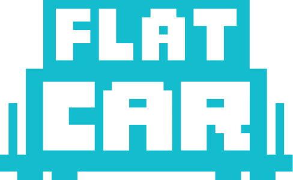

<!-- _footer: '' -->
<!-- _paginate: false -->

# Booting into Kubernetes with an Immutable OS

## Santiago Merlos · Cloud Native Valencia 2026

<!--
Open by introducing myself and the talk. Keep it slow. No need to rush the title.
The talk is about how the real problem of operating Kubernetes on-prem forced us
to rethink what it even means to install a node.
-->

---

<!-- _class: lead -->

# Santiago Merlos

<!--
Introduce yourself. Just the name. The audience cares about the story, not the
bio. Move on quickly.
-->

---

<!-- act: 1-what-we-did -->

## What we do

<div class="cols">

<div>

### furyctl

CLI for the full cluster lifecycle: install, bootstrap, upgrade, drift detection, repair. Declarative input — one tool drives the cluster from empty hardware to a running, kept-current Kubernetes.


<span class="handle">github.com/sighupio/furyctl</span>

</div>

<div>

### SIGHUP Distribution

Modular, upstream-based Kubernetes distribution. Opinionated where production matters (networking, ingress, observability, security), boring where it should be. The set of components furyctl assembles.


<span class="handle">github.com/sighupio/distribution</span>

</div>

</div>

<!--
Act 1, one slide, two columns. furyctl on the left: the lifecycle CLI — install,
bootstrap, upgrade, drift detection, repair, all from a declarative manifest.
SIGHUP Distribution on the right: the modular Kubernetes distribution built on
upstream that furyctl actually deploys. Together they keep clusters consistent
across customers, environments, and years. Point at the QR codes if anyone wants
to follow along — they go to the GitHub repos. Then move on quickly; the talk
is not about the tools, it's about what they taught us.
-->

---

<!-- act: 2-on-prem -->

# On-prem is where it hurts

Every environment is different:

- Hardware
- Networking
- Operating systems
- Kernels
- Configuration drifts

<!--
On-prem is where the real variance lives. Walk through the list slowly. Each
bullet is a customer who told us "we already use X" and meant it. Multiply seven
dimensions of variance and you don't have a product anymore — you have a per-site
integration project pretending to be a product.
-->

---

<!-- act: 3-4-installation-was-the-wrong-model -->

<!-- _class: breathe -->

# Installation was the wrong model

Automating Kubernetes and the distribution wasn't enough — we had to take care of **the OS itself**.

We stopped thinking about **installing** nodes. We started thinking about **provisioning** them.

> If pods are ephemeral and replaceable — why aren't the nodes?

<!--
Acts 3 and 4 compressed. Open with the shift in scope: automating Kubernetes
and our distribution was not enough — we had to take care of the operating
system too. Then the verb change: we stopped thinking about installing nodes,
we started thinking about provisioning them. Pause. Then the question that
kept echoing: if pods are ephemeral and replaceable, why are we still treating
the nodes underneath them like pets? Say it slowly. The rest of the talk is
the answer.
-->

---

<!-- act: 5-flatcar-intro -->

<div class="logos">

 &nbsp;&nbsp;&nbsp; 

</div>

# We didn't want to reinvent the wheel

**What it gives us:**

- **Immutability** — drift cannot accumulate
- **Optimized for containers** — only the tools the cluster needs
- **Open source · CNCF project** — community-owned, vendor-neutral
- **Not general-purpose** — built for one job, does it well

<!--
First Flatcar slide. The title carries the message: we didn't want to reinvent
the wheel. Flatcar already embodied the model we'd reasoned our way to. Don't
sell it — just name what it gives us. Immutability via the read-only /usr
partition means drift cannot accumulate. Optimized for containers means the OS
only ships what the cluster actually needs. Open source under the CNCF means
the project is community-owned and vendor-neutral. And the most important
property: it is not a general-purpose Linux distribution — it is built for one
job, running containers, and it does that job well. Show the logos at the top
without dwelling on them.
-->

---

<!-- act: 6-flatcar-maturity -->

# Maturity & license

License: **Apache 2.0** — open source, vendor-neutral.

**Timeline:**

- **2013** — CoreOS Container Linux: the first immutable, container-first Linux
- **2018** — Red Hat acquires CoreOS · Container Linux is discontinued · **Kinvolk** forks it → **Flatcar**
- **2021** — Microsoft acquires Kinvolk, keeps the project alive
- **2024** — Flatcar donated to the **CNCF** · now community-owned

**Mature · community-driven · production-proven.**

<span class="sources">Sources: cncf.io/projects/flatcar · flatcar.org · github.com/flatcar/Flatcar · opensource.microsoft.com (Oct 2024)</span>

<!--
Second Flatcar slide. This one carries the maturity and licensing argument.
Open with the license: Apache 2.0 — open source and vendor-neutral, so adopting
Flatcar does not lock us into any one company. Then walk the timeline as four
year markers. 2013 — CoreOS Container Linux launches, the first immutable
container-first Linux. 2018 — Red Hat acquires CoreOS and discontinues
Container Linux, but Kinvolk forks it the same year as Flatcar. 2021 —
Microsoft acquires Kinvolk and keeps the project alive. 2024 — Flatcar is
donated to the CNCF and becomes a community-owned project. Close on the three
adjectives: mature, community-driven, production-proven. The sources line at
the bottom is for credibility — point at it briefly so the audience knows the
dates are not invented.
-->

---

<!-- act: 6b-mutable-vs-immutable -->

# Mutable vs immutable OS

## Less surface. Stronger guarantees. Safer by design.

|                      | **Mutable OS**            | **Immutable OS**             | **Practical effect**           |
|----------------------|---------------------------|------------------------------|--------------------------------|
| **Filesystem**       | Writable everywhere       | Read-only `/usr`             | Drift impossible               |
| **Package manager**  | `apt` / `yum` / `dnf`     | None — image is the contract | Nothing to install at runtime  |
| **Config**           | Hand-edited post-install  | Declarative at first boot    | Same input → same node         |
| **Updates**          | In-place package upgrades | Atomic A/B partition swap    | Reboot = upgrade               |
| **Rollback**         | Restore from backup       | Switch partition             | Reboot = rollback              |

<!--
Comparison slide. Open with the tagline: less surface, stronger guarantees,
safer by design — that is the spirit of the whole table. Then walk the five
rows at a steady pace and land each "practical effect" column hard. Filesystem
is read-only on /usr — drift is impossible because there is nowhere for it to
accumulate. No package manager — no apt, no yum, no dnf — so there is nothing
to install at runtime; the image itself is the contract, which is also a
smaller attack surface. Config is declarative at first boot via Ignition, so
the same input produces the same node every time. Updates are atomic A/B
partition swaps, so a reboot is the upgrade mechanism. Rollback is the same
partition switch in reverse — no recovery project, just a reboot.
-->

---

<!-- act: 7-ab-partitions -->

# A/B partitioning

## Two root partitions. One active. One spare.

```
   ┌──────────────┐          ┌──────────────┐
   │  /usr  [A]   │  active  │  /usr  [B]   │  passive
   └──────────────┘          └──────────────┘
            ↓ update writes the new image to B
   ┌──────────────┐          ┌──────────────┐
   │  /usr  [A]   │  active  │  /usr  [B]   │  ready
   └──────────────┘          └──────────────┘
            ↓ reboot → bootloader flips the active flag
   ┌──────────────┐          ┌──────────────┐
   │  /usr  [A]   │ passive  │  /usr  [B]   │  active
   └──────────────┘          └──────────────┘
            ↓ rollback = one more reboot back to A
```

**Update = write to spare + reboot.** No half-installed states.
**Rollback = reboot.** Last known-good image is one partition away.

<!--
A/B partitioning slide. The mental model is two root partitions. One is active
and running the node right now, the other is passive and ready. An update
writes the new image to the passive partition while the system stays online —
no service interruption, no half-installed state. A reboot flips the
bootloader's active flag and the node boots from the freshly written
partition. If anything breaks, you reboot back to the previous partition.
That's the rollback — there is no recovery project, no restore-from-backup
procedure. The previous known-good image is always one reboot away. This is
why upgrades in Flatcar are boring: they are the same operation as rolling
back, just in the other direction.
-->

---

<!-- act: 7b-butane-ignition -->

# Declarative config

```yaml
variant: flatcar
version: 1.1.0
passwd:
  users:
    - name: smerlos
      ssh_authorized_keys: [ssh-ed25519 AAA...]
storage:
  files:
    - path: /etc/hostname
      contents:
        inline: worker-01
systemd:
  units:
    - name: kubelet.service
      enabled: true
```

**Pipeline:** `butane → Ignition (JSON) → first boot → done`. Runs once, before systemd. **No scripts. No SSH. Same input → same node.**

<!--
Butane and Ignition. Butane is the human-friendly YAML format — readable,
diffable, reviewable in a pull request. The butane tool compiles it to
Ignition JSON, which is what the machine actually consumes. The example on
screen targets the Flatcar variant 1.1.0 spec, the current stable. Ignition
runs exactly once, very early in the boot process, before systemd is up. It
sets up the filesystem, users, SSH keys, files, networking, and systemd
units — declaratively. It is not a script. There is no SSH-in step. There is
no post-install configuration management. The same Butane input produces the
same node, every time. This is what makes provisioning reproducible: the
configuration travels with the boot, not after it.
-->

---

<!-- _class: tight -->
<!-- act: 8-sysext -->

# System extensions (`sysext`)

## Add software without breaking immutability.

- `/usr` is **read-only** — no `apt`, no `yum`.
- Cluster needs kubelet, containerd, custom binaries.
- A **sysext** = read-only overlay → drops files into `/usr` at runtime.
- Activate → files appear · Deactivate → files gone · OS untouched.
- **Defined in the declarative config** (same Butane / Ignition flow).
- **`furyctl`** pulls sysexts from upstream alongside the boot artifacts.

```
   ┌──┬───────────────┬──┐
   │  │  tools.raw    │  │   ◀── add · swap · remove anytime
   ├──┴───────────────┴──┤
   │   containerd.raw    │   ◀── one image, one feature
   ├──┬───────────────┬──┤
   │  │  kubelet.raw  │  │   ◀── stackable, like LEGO bricks
   └──┴───────────────┴──┘
   ═══════════════════════
   │    Flatcar /usr     │   ◀── read-only base, never modified
   └─────────────────────┘
```

**Composable · reversible · survives OS upgrades.**

<!--
System extensions, placed right after the declarative config slide so the
audience can connect the two. Flatcar's /usr is read-only — no apt, no yum,
no install scripts. But every cluster still needs software that is not in the
base image: kubelet, containerd, our own binaries. A sysext is a small
read-only image overlay that drops files into /usr at runtime. Activate it
and the files appear, deactivate it and they disappear, and the OS image
itself is never touched. They are defined declaratively in the same Butane
manifest we just looked at, so they ride the same pipeline. furyctl pulls
the sysext images from upstream as part of the asset bundle, alongside the
kernel and initramfs. Sysexts are composable, reversible, and they survive
OS upgrades because the base image is independent. This is what makes the
immutable model practical, not theoretical.
-->

---

<!-- _class: tight -->
<!-- act: 9-pxe-boot -->

# Network boot (PXE)

## Zero-touch provisioning — node boots straight from the network.

```
   ┌──────────┐
   │   node   │
   └────┬─────┘
        │   1. power on, DHCP discover
        ▼
   ┌────────────────────────────────────────────────────────┐
   │  DHCP server   10.0.0.1                                │
   │  reply:  ip · dns · gw · next-server · filename        │
   └────┬───────────────────────────────────────────────────┘
        │   2. node now knows the asset server
        ▼
   ┌────────────────────────────────────────────────────────┐
   │  Asset server   10.0.0.10    ◀── different host        │
   │  serves:  ipxe.efi → kernel → initramfs → /ign/<mac>   │
   └────┬───────────────────────────────────────────────────┘
        │   3. Ignition downloads + installs declaratively
        ▼
   ┌──────────┐
   │   node   │   running Flatcar, joined to cluster
   └──────────┘
```

**DHCP** hands out network identity + a pointer. **Asset server** (a different host) serves everything Flatcar.

**No USB sticks. No installer wizards. No human at the rack.** Same image, every node.

<!--
PXE boot. The node ships with no operating system installed. On power-on, the
firmware sends a PXE request. The DHCP reply carries the two values the
firmware needs to boot: next-server points at our asset server, and filename
names the bootloader to download — in our case ipxe.efi, which then chainloads
the kernel and initramfs from the same server. The kernel boots with a command
line that tells Flatcar where its Ignition config lives: flatcar.first_boot=1
marks this as the first boot, and flatcar.config.url is the per-node URL that
Ignition will fetch. The MAC substitution gives every node its own manifest
while the boot infrastructure stays shared. Ignition runs, applies the config
declaratively, and the node comes up already configured. No installer wizard,
no USB stick, no human at the rack.
-->

---

<!-- act: 10-putting-it-together -->

# Putting it all together

## `furyctl.yaml` — the single source of truth.

```
   furyctl.yaml  ◄── single source of truth
        │
        ▼
   ┌────────────┐   1. read manifest, generate every config
   │  furyctl   │   2. pull upstream assets ────────► Flatcar releases
   └────────────┘      (kernel · initramfs · sysexts  container registries
        │              · container images · binaries) upstream mirrors
        │   3. spin up the asset server with what was pulled
        ▼
   ┌──────────────────────────────────────────┐
   │  PXE / HTTP server: serves Flatcar boot  │
   │  artifacts + per-node Ignition payload   │
   └──────────────────────────────────────────┘
        │  4. nodes PXE-boot, Ignition provisions them
        ▼
   ┌──────────────────────────────────────────┐
   │  Ansible: certificates · kubeadm join    │
   └──────────────────────────────────────────┘
        │
        ▼
   running Kubernetes cluster
```

**We don't configure the OS. We configure the cluster.**

<!--
The synthesis slide. One file in, a running Kubernetes cluster out. The input
is furyctl.yaml — the single source of truth for the entire cluster. furyctl
reads it and generates every configuration the cluster needs. As a side step
that matters operationally, furyctl also pulls the upstream assets — the
Flatcar kernel and initramfs, container images, binaries — from the upstream
sources, so the asset server we spin up next is self-contained and the
provisioning can run in air-gapped or restricted-network environments. Then
the asset server starts and serves the Flatcar boot artifacts plus the per-
node Ignition payload. Nodes PXE-boot from it, Ignition provisions each one
declaratively, Ansible handles certificates and kubeadm join, and the cluster
comes up. The line I want the audience to keep is at the bottom: we don't
configure the OS. We configure the cluster. The OS configures itself from
furyctl.yaml, every time, the same way.
-->

---

<!-- _class: lead -->
<!-- act: 11-demo -->

# Demo

## One file. One command. One running cluster.

<!--
Demo slide. Switch to the terminal. Open furyctl.yaml — the single source of
truth — and walk the audience through the relevant fields. Run furyctl apply.
Show the asset server coming up with kernel, initramfs, sysexts, and the
per-node Ignition payload. Power on the node (or the VM standing in for it)
and let it PXE-boot from the asset server. Ignition runs at first boot and
provisions the node declaratively. Flatcar comes up. Ansible distributes
certificates and runs kubeadm join. The node appears in kubectl get nodes,
ready. The point of the demo is not the speed — it is the reproducibility:
the same input produces the same node, every time, with no SSH and no manual
step. If anything fails, that is also a useful moment to discuss: a failed
provisioning is recoverable by re-running the same manifest, because the
process is idempotent.
-->

---

<!-- _class: lead -->

> The more we automated Kubernetes, the more we realized we needed to standardize everything before Kubernetes even starts.

## — Santiago Merlos · Cloud Native Valencia 2026

<!--
Closing quote. The synthesis. This is the line I want the audience to take
home. Say it slowly. Don't follow it with anything except a thank-you.
-->

---

<!-- _class: lead -->
<!-- _footer: '' -->
<!-- act: 13-qa -->

# Questions?

## Thank you.

<div class="qa-qrs">

<div>


**Download the slides** — PDF · PPTX
`.../releases/latest`

</div>

<div>


**Connect on LinkedIn**
Santiago Merlos

</div>

</div>

**Santiago Merlos** · `@smerlos` · Cloud Native Valencia 2026

<!--
Q&A slide. Leave it up while taking questions. Two QR codes on screen:
left is the GitHub release so the audience can download the slides as PDF or
PPTX (it always resolves to the latest release), right is
my LinkedIn — this is a meetup, so invite people to connect and continue the
conversation over drinks after the talks. Keep answers short — if a question
needs a deeper answer than the room
time allows, offer to continue at the booth. Do not start a new train of
thought.
-->
